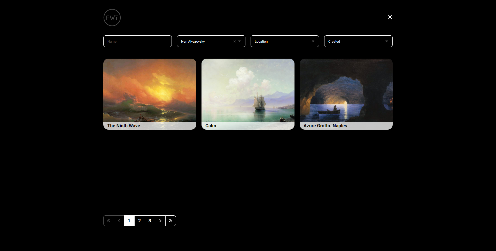

# FWT - тестовое задание компании Framework Team

## Table of contents

  - [The challenge](#the-challenge)
  - [Screenshot](#screenshot)
  - [Links](#links)
  - [Built with](#built-with)
  - [Author](#author)

### The challenge

- Выполнить на фреймворке react.js
- Для того, чтобы самим не собирать сборку - использовать create react app
- Вся работа с фильтрами и пагинацией должна происходить через сервер, а не локально
- Верстка должна быть резиновой

### Screenshot

### Links

- [Live Site](https://hromus-51.github.io/FWT-test-task/)

### Built with

- JS
- [React](https://reactjs.org/) 
- [Redux Toolkit](https://redux-toolkit.js.org/)
- [Styled Components](https://styled-components.com/)
- [Framer Motion](https://www.framer.com/motion/)
- [Material UI](https://mui.com/material-ui/react-pagination/)

## Author

- Telegram - [Ilgiz Farrakhov](https://t.me/Ilgiz_front)